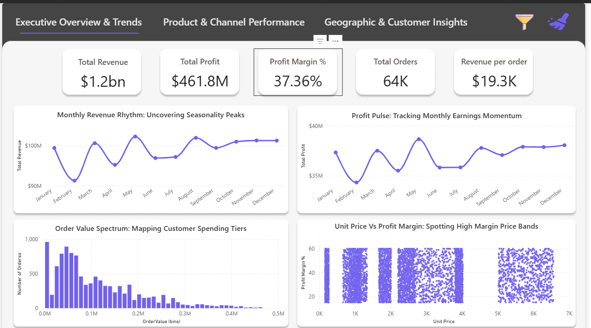
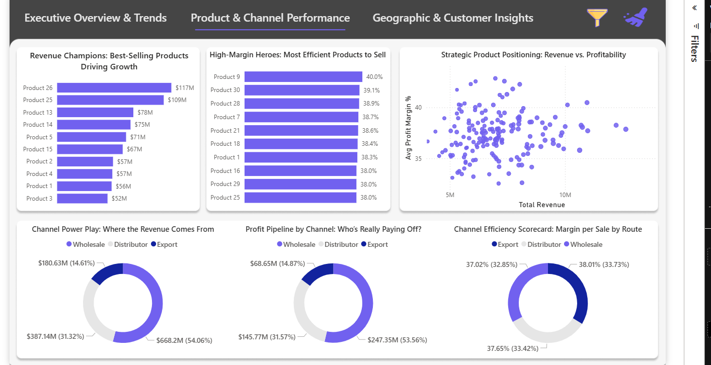
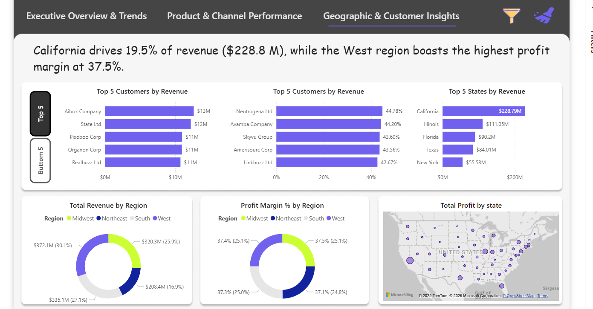

# Data Analytics in Sales Domain

## Overview

This project focuses on applying data analytics techniques to the sales domain. The goal is to derive insights that can help improve sales performance and drive business strategies.

## Features

### Page 1: Interactive Sales Dashboard (Executive Overview & Trends)

This comprehensive dashboard provides a high-level executive summary of sales performance. It prominently displays key performance indicators (KPIs) such as **Total Revenue**, **Total Profit**, **Profit Margin %**, **Total Orders**, and **Revenue per order**, offering an immediate snapshot of business health. Furthermore, it includes detailed visualizations like:

- **Monthly Revenue Rhythm:** A time-series chart that uncovers seasonality and identifies peak revenue periods throughout the year.
- **Profit Pulse:** Tracks monthly earnings momentum, allowing for quick identification of growth or decline trends in profit over time.
- **Order Value Spectrum:** A distribution chart that maps customer spending tiers, helping to understand typical order sizes and identify high-value customer segments.
- **Unit Price Vs Profit Margin:** A scatter plot designed to spot high-margin product bands by correlating unit price with profit margin, aiding in strategic pricing and product focus.

### Page 2: Product & Channel Performance Dashboard:

This dashboard provides granular insights into how products and sales channels are performing. It helps in identifying what's working and where improvements can be made:

- **Revenue Champions:** Highlights the best-selling products by total revenue, indicating which products are driving overall sales volume.
- **High-Margin Heroes:** Identifies the most efficient products to sell based on their profit margin percentage, guiding efforts towards maximizing profitability.
- **Strategic Product Positioning:** A scatter plot analyzing product revenue versus profitability, enabling strategic decisions on which products to push for growth versus those to optimize for margin.
- **Channel Power Play:** Detailed breakdown of where revenue comes from across different sales channels (e.g., Wholesale, Distributor, Export), showing their respective contributions in both absolute values and percentages.
- **Profit Pipeline by Channel:** Visualizes the profit generated by each sales channel, providing clarity on the most lucrative distribution routes.
- **Channel Efficiency Scorecard:** Assesses the margin per sale by route, offering a direct comparison of the profitability efficiency across various sales channels.

### Page 3: Geographic & Customer Insights Dashboard:

This section offers a deep dive into sales performance based on geographic regions and individual customer contributions, providing actionable insights for targeted strategies:

- **Top 5 Customers by Revenue:** Identifies the highest-contributing customers in terms of total revenue.
- **Top 5 Customers by Profit Margin:** Highlights customers that generate the highest profit margins, indicating valuable relationships.
- **Top 5 States by Revenue:** Pinpoints the states with the highest revenue generation, useful for regional sales focus.
- **Total Revenue by Region:** A clear visualization of revenue distribution across different geographic regions (e.g., Midwest, Northeast, South, West).
- **Profit Margin % by Region:** Shows the profitability percentage for each region, helping to identify regions with high or low efficiency.
- **Total Profit by State (Map Visualization):** A geographic map that visually represents total profit across different states, allowing for quick identification of high-profit areas.
- **Key Insights:** Provides a summary of critical findings, such as "California drives 19.5% of revenue ($228.8 M), while the West region boasts the highest profit margin at 37.5%."

## Data Source

- The Excel file provided in the repository is used in the project.
- The EDA is also provideo in the repository.
